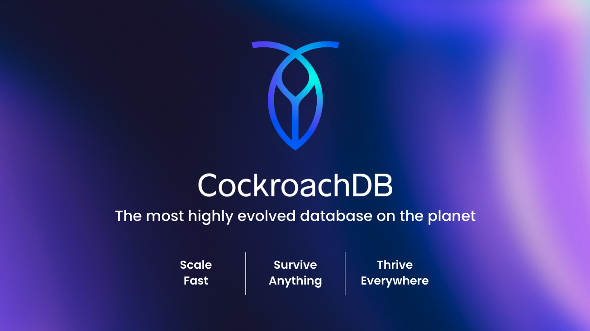
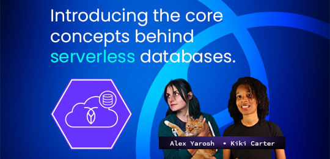

# Part 1: Introduction to CockroachDB and Serverless

## 🪳 CockroachDB serverless

- Postgres Compatible Database
- Elastic Scale
- Consumption Based Pricing
- Start for free. No credit card needed
- 5GB of storage and 250M RUs per month
- Use with your favorite language

## 🎓 Learn more at Cockroach University

[][intro-to-serverless-course]

Interested in learning more about the core concepts behind serverless databases and getting started with CockroachDB serverless? Check out the free self-paced ["Introduction to Serverless Databases and CockroachDB Serverless"][intro-to-serverless-course] course from Cockroach University.
 \*Free swag available upon course completion. (while supplies last)

| [Back](../README.md) | [Next](part-2.md) |
| -------------------- | ----------------- |

[intro-to-serverless-course]: https://university.cockroachlabs.com/courses/course-v1:crl+intro-to-serverless+self-paced/about?utm_source=hackathon&utm_medium=event-hackathon-2023&utm_content=cu-course-cu-intro-to-serverless-course
