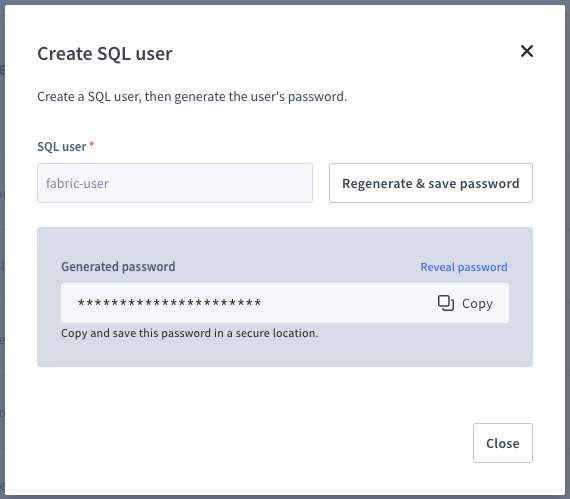
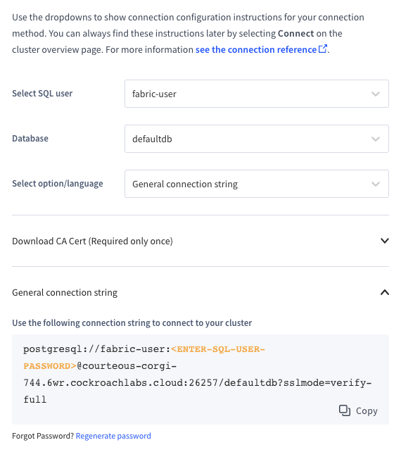

# Part 2: Setup the Dev Environment & CockroachDB serverless

## Dev Environment

### Prerequisites

- [Python 3.11+](https://wiki.python.org/moin/BeginnersGuide/Download)
- [Poetry](https://python-poetry.org/docs/#installation)
- [Nodejs 14+](https://nodejs.org/en/download)
- [GitHub](https://docs.github.com/en/get-started/quickstart)

1. Open your terminal
1. Clone the repo by executing the following command
   ```shell
   git clone git@github.com:aydrian/fabric-stack-workshop.git
   ```
1. Change directory into `fabric-stack-workshop`
   ```shell
   cd fabric-stack-workshop
   ```
1. There will be 2 folders of interest, `backend` and `frontend`.
1. Change directory into `backend`

   ```shell
   cd backend
   ```

   a. Create a `.env` file by copying `.env.example`

   ```shell
   cp .env.example .env
   ```

   b. Set the value of `SECRET_KEY` in the new `.env` to `619e8e15d08801a1ad036b0a621dffcb26ebf1891c4b1dab1160482f5b83ce55`

   c. Run Poetry install

   ```shell
   poetry install
   ```

1. Change directory into `frontend` and run NPM install
   ```shell
   cd  ../frontend
   npm install
   ```

## CockroachDB serverless

1. In your web browser, navigate to http://cockroa.ch/hackabull2023
1. Sign up / Log in (easiest to log in with Github, Google etc)
1. Create a Free Cluster
1. You will be prompted to create a user and password. On the connection page, copy the connection string and save it in `backend/.env` as `DATABASE_URL`

   

   

   Your `backend/.env` file:

   ```shell
   DATABASE_URL="YOUR DATABASE URL"
   SECRET_KEY="619e8e15d08801a1ad036b0a621dffcb26ebf1891c4b1dab1160482f5b83ce55"
   ACCESS_TOKEN_EXPIRE_MINUTES=360
   ```

## Cockroach CLI

In your Cockroach Cloud Console:

1. Click the Connect button in the top right corner.
1. Change "Select option/language" to "CockroachCloud CLI." Open the "Download the latest CCloud CLI" section.
1. Follow the instructions for your operating system.
1. In the terminal, log in by running the following command:
   ```shell
   ccloud auth login
   ```
1. Now you can open a CockroachDB SQL Shell by running the following command in your terminal:
   ```shell
   ccloud cluster sql
   ```

## Test your connection

1. Open a second terminal window and navigage to fabric-stack-workshop/backend
1. Start the server

   ```shell
   poetry run python backend/main.py
   ```

1. Open a new browser window and navigate to http://localhost:8000/test-db-connection
1. If you see the current date and time, Congrats! 🎉 You're ready to proceed.

| [Back](part-1.md) | [Next](part-3.md) |
| ----------------- | ----------------- |
