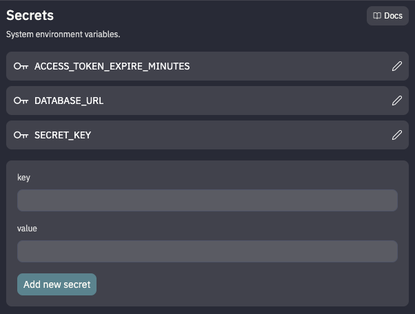

# Part 2: Setup Replit & CockroachDB serverless

## 🧑‍💻 Replit

1. Create a new Repl by going to https://replit.new
1. Sign up or log in (if prompted)
1. Click the Import from GitHub button, enter `github.com/aydrian/fabric-stack-workshop` as the GitHub URL, and click Import from GitHub

That's it! 🎉 Proceed to the next section.

## 🪳 CockroachDB serverless

### 🪄 Create a new serverless cluster

1. Choose one of the links below to get started.
   <br /><sub>CMD+click (Mac) or CTRL+click (Windows/Linux) to open in a new tab.</sub>
   - [Hackabull 2023](http://cockroa.ch/hackabull2023)
   - [Bitcamp 2023](http://cockroa.ch/bitcamp23)
   - [All Others](https://cockroachlabs.cloud/signup?referralId=fabric_stack_workshop?&utm_source=fabric_stack_workshop&utm_medium=event&utm_campaign=hackathon)
1. Sign up / log in (easiest to log in with GitHub, Google, etc.)
1. Create a Free Cluster
   <br /><sub>_If you already have an existing serverless cluster, you can skip to the next section._<sub>
1. You will be prompted to create a user and password. Click the Generate & save password button.

   > **Note**
   > Now would be a good time to record these credentials in a secure location. You won't be able to retrieve the password after this window closes.

   

### 🔒 Add Secrets to your Repl

We'll use the Secrets feature of Replit to hold configuration values. This is how Replit handles private environment variables. You can access them via Tools > Secrets on the left side of your Repl.

1. On the connection page, copy the connection string and save as a Secret in your Repl with a key of `DATABASE_URL`

   

   > **Warning**
   > Be sure the pasted connection string includes the password for the SQL user. If you see `<ENTER-SQL-USER-PASSWORD>`, replace it with the password you saved. If you didn't save your password, you'll need to generate a new one.

1. While we're adding secrets, go ahead and add the following:

   1. `SECRET_KEY`: `619e8e15d08801a1ad036b0a621dffcb26ebf1891c4b1dab1160482f5b83ce55`
      <br /><sub>Used for hashing passwords. We're using this specific key so the mock users will work; you'll want to change this later.</sub>
   1. `ACCESS_TOKEN_EXPIRE_MINUTES`: `360`
      <br/><sub>Specifies how long the auth token should live (currently 6 hours).</sub>

   

   You should have 3 secrets in total.

### 🔐 Add the CA Cert to your Repl

1. On the connection page, change "Select option/language" to "General connection string."
   > **Note**
   > If you closed the connection page, you can access it by clicking Connect on your cluster overview page.
1. Open the "Download CA Cert" section and change the "Select operating system" dropdown to Mac or Linux.
1. Copy the curl command and run it in your Replit Shell (not the Console).
   > **Note**
   > If you don't work on your Repl for a while, you might receive a warning in your Repl Console regarding the CA Cert. If this happens, just run the curl command again.

### ⚡️ Test your conection

In your Repl Shell, run the following command from the root of your project: `python3 test_db_connection.py`

```shell
~/fabric-stack-workshop$ python3 test_db_connection.py
[(datetime.datetime(2023, 4, 5, 13, 26, 55, 434408, tzinfo=datetime.timezone.utc),)]
```

If you see the current date and time, congrats! 🎉 You've successfully connected your Repl to your serverless cluster.

### 🐚 Cockroach SQL Shell

The CockroachDB provides a client for executing SQL statements from an interactive shell or command line. We've provided you with a script that will download the `cockroach-sql` binary and connect to the database specified by the connection string stored in the `DATABASE_URL` secret.

In your Repl Shell, run `./cli.sh`.
<br /><sub>To exit the sql shell, type `quit` or `exit` or `\q`.</sub><br/>

> **Note**
> The SQL Shell supports passing [flags](https://www.cockroachlabs.com/docs/stable/cockroach-sql-binary.html#flags) such as `--file` or `-f` to read SQL statements from a provided file. If you would like to do this, you can execute the `cockroach-sql` binary directly from the Repl Shell after the first time you run `./cli.sh`.

**Congrats! 🎉 You're ready to proceed.**

| [Back](part-1.md) | [Next](part-3.md) |
| ----------------- | ----------------- |
