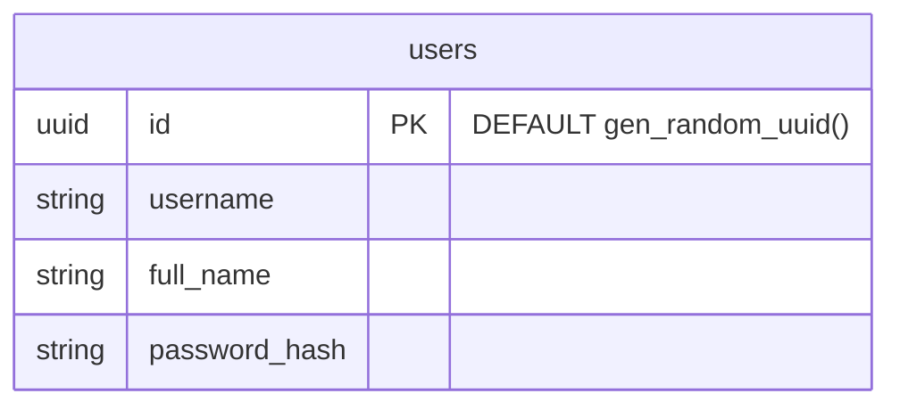

# Part 4: Prepare the database

## Objectives

- Learn SQL: Use the `CREATE TABLE` statement to build your database schema
- Understand how to store passwords in a database
- Import data from a CSV file

### `CREATE TABLE`

To create a table, use `CREATE TABLE` followed by a table name, the column names, and the data type and constraint, if any, for each column.

```SQL
CREATE TABLE {table_name} (
  {col_name} {col_type} {constraints},
);
```

Contraints could include: `NOT NULL`, `DEFAULT {value}`, `PRIMARY KEY`, and `UNIQUE` to name a few.

### Storing Passwords

You'll notice that we will be storing a `password_hash` instead of the actual password in the database. Storing passwords in plain text is a bad practice. In the event of a data breach, all your users would be compromised. Instead we will store the result of a hashing function that uses a secret key. Then we can verify the result of future password hashes against the one in the database.

`security.py` provides functions to `hash_password` and verify_password` to assist you. This has been done for you for the Python functions in the following exercises as needed.

### Excerise: Create a `users` table

Using the CockroachDB SQL Shell (`ccloud cluster sql`), crate a new table that matches the Entity Relationaship diagram below. All fields should be required.



<details> 
<br>
<summary>Solution</summary>

```SQL
CREATE TABLE users (
  id UUID NOT NULL DEFAULT gen_random_uuid() PRIMARY KEY,
  username STRING NOT NULL,
  password_hash STRING NOT NULL,
  full_name STRING NOT NULL,
);
```

</details>

### Exercise: Import Mock Data from a CSV file

Now that we have a `users` tables, let's fill it by importing some mock data from a CSV file. Use the CockroachDB SQL Shell from the previous exercise.

```SQL
IMPORT INTO users (username, full_name, password_hash)
  CSV DATA (
      'https://raw.githubusercontent.com/aydrian/fabric-stack-workshop/main/workshop/assets/mock_data.csv'
  )
  WITH
    skip='1';
```

> **Note**
> You can import from a local file using [Userfile Storage](https://www.cockroachlabs.com/docs/v22.2/use-userfile-storage)

Once that is complete, query all the data from the `users` table.

```SQL
SELECT * FROM users;
```

| [Back](part-3.md) | [Next](part-5.md) |
| ----------------- | ----------------- |
