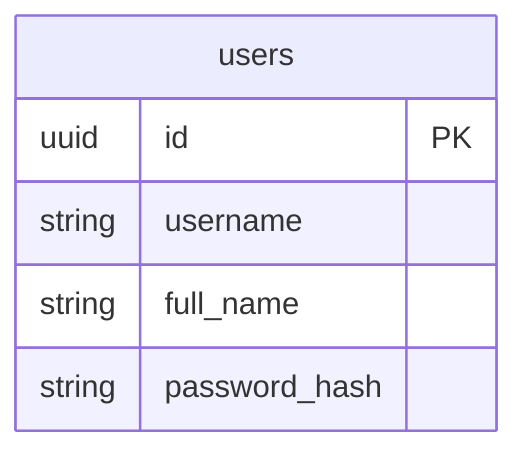

# Part 4: Prepare the database

## Objectives

- Learn SQL: Use the `CREATE` statement to build your database schema
- Understand how to store passwords in a database
- Import data from a CSV file



```SQL
IMPORT INTO users (username, full_name, password_hash)

```

| [Back](part-3.md) | [Next](part-5.md) |
| ----------------- | ----------------- |
