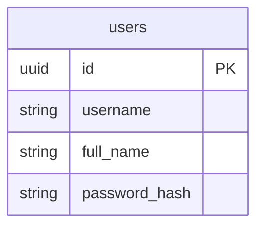

# Part 4: Prepare the database

## Objectives

- Learn SQL: Use the `CREATE` statement to build your database schema
- Understand how to store passwords in a database
- Import data from a CSV file



```SQL
IMPORT INTO users (username, full_name, password_hash)
  CSV DATA (
      'https://raw.githubusercontent.com/aydrian/fabric-stack/main/workshop/assets/mock_data.csv'
  )
  WITH
    skip='1';
```

> **Note**
> You can import from a local file using [Userfile Storage](https://www.cockroachlabs.com/docs/v22.2/use-userfile-storage)

| [Back](part-3.md) | [Next](part-5.md) |
| ----------------- | ----------------- |
